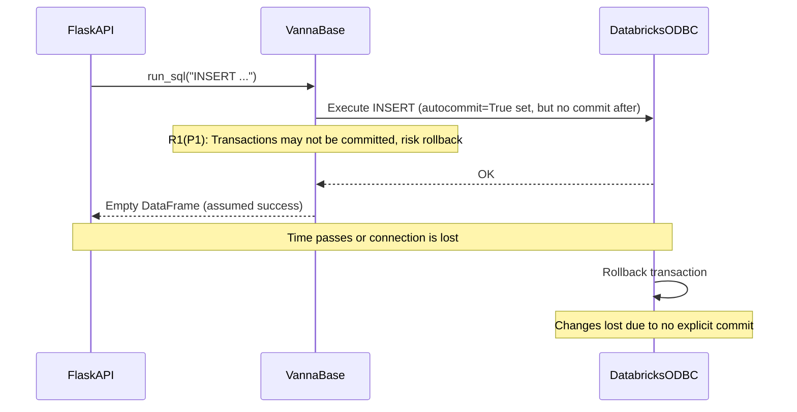

If you lead an engineering team, you've probably felt this: you adopt an AI code reviewer hoping to catch real issues, but instead it floods PRs with style suggestions and variable naming tips. Your developers start ignoring it. The signal drowns in noise.

The problem isn't the AI—it's that most tools only see the **diff**. They can't trace how a changed function ripples through your system, or spot when a new database method silently breaks transaction guarantees in your API layer.

This is why I built LlamaPReview around a different principle: **evidence-driven, repository-wide context analysis**. Today it runs in over 4,000 repositories. But the real validation came when it caught a production-breaking bug that looked perfectly fine on the surface.

## A Real Bug That Slipped Past Human Review

Let me show you what deep context looks like in practice.

A developer submitted [PR #951](https://github.com/vanna-ai/vanna/pull/951) to **Vanna.ai**, a popular open-source text-to-SQL tool with 20,000+ stars. The change added Databricks integration—156 lines of well-documented code supporting two connection engines (SQL warehouse and ODBC).

A typical review would flag style issues:
- "This function is quite long, consider splitting it"
- "Add more inline comments"
- "Variable naming could be clearer"

LlamaPReview found something else entirely:

> **Critical: Transaction Commit Failure in ODBC Mode**
>
> The ODBC implementation sets `autocommit=True` but never explicitly commits transactions. Meanwhile, `src/vanna/flask/__init__.py`'s `run_sql()` endpoint assumes all operations auto-commit.
>
> **Impact:** INSERT/UPDATE statements may execute successfully but roll back silently on disconnect, causing data loss without error messages.

Here's why this matters: **`src/vanna/flask/__init__.py` wasn't even part of the diff**. LlamaPReview automatically retrieved it from the repository context because it identified the Flask API as a downstream caller of the new database connection code. The bug required understanding **two separate files** and how they interact at runtime—something impossible if you only analyze changed lines.

It even generated a risk diagram showing the exact failure scenario:

This is the kind of bug that causes 3 AM incidents—and the kind that surface-level analysis will never catch.

## What "Deep Context" Actually Means

The difference comes down to what the AI can see:

**Traditional AI Review:**
- **Analyzes:** The diff (changed lines only)
- **Understands:** Syntax, local style, basic patterns
- **Finds:** Naming issues, formatting, simple bugs
- **Result:** High volume, low signal

**Deep Context Analysis:**
- **Analyzes:** The entire repository as a connected system
- **Understands:** Call graphs, dependency chains, API contracts
- **Finds:** Cross-module impacts, behavioral inconsistencies, architectural risks
- **Result:** Low volume, high signal

LlamaPReview's approach is built on three principles:

**1. Whole-repository understanding**  
Before analyzing a PR, we map your codebase's structure—which functions call what, how modules depend on each other, where data flows. When you change a function signature, we know every caller that might break.

**2. Evidence-driven findings**  
Every issue includes specific code evidence. Not "this might cause problems," but "in `auth.py:142`, `validate_token()` calls your modified API without handling the new `TokenExpiredError` exception you introduced."

**3. Intelligent prioritization**  
Findings are ranked by actual impact:
- **Critical:** Will cause production failures
- **Important:** Architectural or performance risks
- **Minor:** Code quality improvements

The goal isn't more comments—it's surfacing the **one thing** that matters.

## The Unexpected Journey: From a Hacker News Post to 4,000+ Repositories

When I launched LlamaPReview on [Hacker News in October 2024](https://news.ycombinator.com/item?id=41996859), I expected some polite feedback from a few dozen developers. Maybe a handful of installations.

Instead, the post hit [#28 on Hacker News Daily front page](https://news.ycombinator.com/front?day=2024-10-30). Over 100 upvotes. 42 comments debating what "good code review" really means. And then the installations started rolling in—and they haven't stopped.

Over the following months, I iterated based on user feedback—adding deeper dependency analysis, inline comments, and architectural diagrams. By August 2025, the Advanced tier was ready, and the response validated something important: developers don't want more AI noise. They want tools that respect their time and surface what truly matters.

Today, the numbers tell a story I didn't anticipate:
- **4,000+ repositories** now use LlamaPReview (roughly 60% open-source, 40% private)
- **35,000+ combined GitHub stars** across subscribed projects
- Trusted by teams behind **Vanna.ai** (20K stars), **BlueWave Labs** (8.5K stars), and **pdfvuer** (1K stars)

The project was featured in [Salvatore Raieli's AI/ML Weekly](https://salvatore-raieli.medium.com/ai-ml-news-week-11-17-november-b2f4093575cc) and received unsolicited reviews like [this YouTube walkthrough](https://www.youtube.com/watch?v=NgUsxB5fQuM). Growth has been entirely organic—no sales team, no ads, no cold outreach.

Why did it resonate? I think it's because developers are exhausted by noise. When a tool respects your time and helps you find what truly matters, you remember it. And you tell your team.

One pattern I didn't anticipate: teams using reviews as **onboarding tools**. New engineers learn the codebase's hidden dependencies by reading LlamaPReview's explanations of why their changes matter. It's like having a senior architect who's memorized the entire call graph—and is patient enough to explain it.

## What We Got Wrong (And What We're Fixing)

The current approach has proven its value, but I'm honest about where it breaks down. These aren't just technical challenges—they're fundamental limitations of the architecture:

**1. Scalability ceiling**  
For repositories with 100K+ lines of code, building comprehensive dependency maps becomes computationally expensive. Analysis times can stretch to more than 10 minutes. We've optimized aggressively—caching strategies, incremental analysis, parallel processing—but there's a hard limit to how far traditional dependency tracing can scale.

**2. Cross-repository blindness**  
If your microservices architecture spans multiple repos, we can't trace dependencies across the boundary. A breaking API change in Service A won't trigger warnings in Service B's repo. For teams with 10+ interconnected services, this is a real gap.

**3. Complex indirect call chains**  
When function A calls B, which calls C, which calls D, and your PR modifies D, we sometimes miss the full ripple effect. Our current approach can trace 2-3 levels deep reliably, but beyond that, the analysis becomes probabilistic rather than deterministic.

**4. Dynamic behavior limitations**  
Code that uses heavy reflection, dynamic imports, or runtime code generation is harder to analyze statically. We can catch most cases, but not all.

These limitations don't make the tool useless—far from it. But they define the boundary of what's possible with the current generation of dependency analysis. And they point toward what needs to come next.

## The Path Forward: Repository Graph RAG

You can't solve these problems by throwing more compute at them, or by fine-tuning better prompts. You need a fundamentally different approach.

Over the past few months, I've been prototyping a new architecture that addresses these limitations: **Repository Graph RAG**.

Instead of treating code as text to be embedded and retrieved, we're building a true knowledge graph—nodes for functions, classes, and modules; edges for calls, imports, and data flows. When you change a function, we don't search for "similar" code. We traverse the actual dependency graph to find every affected caller.

**Early results are promising:**
- In synthetic benchmarks on code understanding tasks, Graph RAG outperforms traditional vector-based retrieval by **70%**
- Analysis of complex call chains (5+ levels deep) shows **near-perfect accuracy** versus ~60% with current methods
- Memory footprint scales **logarithmically** rather than linearly with repository size

More importantly, the architecture is designed to:
- **Scale to massive monorepos** (100K+ lines) with sub-minute analysis times
- **Bridge across multiple repositories** by linking graph nodes via API contracts
- **Handle dynamic behavior** by incorporating runtime profiling data into the graph

This isn't vaporware. I have a working prototype. It's not production-ready yet—there are rough edges around graph construction speed and query optimization—but it's real enough to demonstrate the concept and validate the approach.

I'll be sharing the technical details, architecture diagrams, and a live demo in upcoming posts. But the core insight is simple: **code isn't just text. It's a graph. And if you want to truly understand it, you need to treat it like one.**

## Beyond PR Reviews: What This Unlocks

Here's the bigger picture: PR review is just the entry point.

Once you have a system that deeply understands code structure and can reason about changes, you unlock a whole category of problems:

- **Automated test generation** based on actual execution paths (not just code coverage, but *semantic* coverage)
- **Intelligent refactoring suggestions** that know what's safe to change and what will break
- **Impact analysis before you write code** ("If I change this API, what breaks?")
- **Onboarding assistance** that explains how systems actually work, not just what the comments say
- **AI agents that genuinely collaborate** on development—not by guessing, but by understanding

We're not building a better linter. We're building the foundation for AI that understands code well enough to make engineers 10x more effective.

That's the future I'm working toward. And I believe the path runs through graph-based code understanding.

---

**If you're working on similar problems—or thinking about how AI can improve developer workflows at your organization—I'd love to connect.** You can find me on [LinkedIn](https://www.linkedin.com/in/jiantongxu/), where I share insights from both my work in enterprise architecture and my experiments with AI-powered developer tools.

I'll be publishing more about the Graph RAG architecture, benchmarks, and a live demo in the coming weeks. Follow along if you're interested in the future of code understanding.

*LlamaPReview is available now at the [GitHub Marketplace](https://jetxu-llm.github.io/LlamaPReview-site). The Community/Advanced tier is free forever for all repos/open-source projects.*